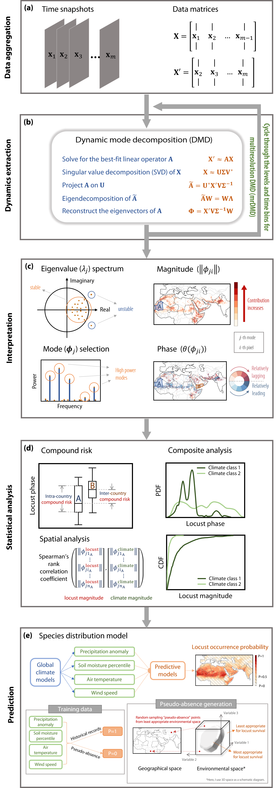

# locust-climate-DMD

### Overview:
-----------
This is the official repository for the paper "[Unveiling the Role of Climate in Spatially Synchronized Locust Outbreak Risks](https://www.science.org/doi/full/10.1126/sciadv.adj1164)" published in Science Advances on 14 Feb 2024. This study develops a data-driven workflow to unravel the complex relationship between locust and climate dynamics across multiple spatial and temporal scales (see Fig. S1). The method enables us to explore the underlying spatiotemporal dynamics utilizing a large stream of data without high-dimensional computational burden. We first create monthly time snapshots for locust occurrence, locust control, and climatic variables (Fig. S1a). We then implement modern dimension reduction techniques to extract dominant spatiotemporal dynamics of locust and climate (Fig. S1b). These dynamics allow us to identify hot spots of locust infestation and quantify the within- and cross-country compound risk of locust outbreak (Fig. S1c-d). We also conduct statistical analysis to investigate the locust-climate relationship and examine how such relationship varies across different climatic zones, control measures, and climate variability patterns (Fig. S1d). Finally, we extend our analysis to future periods with additional climate change scenarios using species distribution models (Fig. S1e). 

This repository is under active development. For archived data and codes, please see the [Zenodo](https://zenodo.org/records/10486653) version.

<p align="center">
  
</p>

Figure S1. Overall workflow summarizing the data-driven, equation-free dynamic pattern discovery and compound locust risk analysis. We first aggregate the data of locust frequency and climate variables, producing time snapshots and corresponding matrices (panel a). Then we extract the dynamic patterns using dynamic mode decomposition (DMD) by singular value decomposition and eigendecomposition (panel b). For stable dynamic modes having eigenvalues inside the unit circle, we select the most important modes with high powers (panel c). We obtain the magnitude and phase, which can pinpoint the hotspot and show the spread of locusts (panel c). The intra- and inter-country compound locust risks are analyzed by phase range and median phase difference (panel d). Spatially-filtered Spearman's rank correlation is utilized to show the linkage between locust abundance and climatic conditions. We also analyze the empirical cumulative distribution function (CDF) and probability distribution function (PDF) composited on different climatic or control conditions. Finally, we extend our analysis to future periods with additional climate change scenarios using species distribution models and multi-model climate ensembles (panel e). See Methods in our paper for details. 

### Structure:
-----------
We provide an example `demo_mrdmd.py` to show how to retrieve spatiotemporal locust patterns and quantify the influence of El Nino/La Nina events. It will be developed into an interactive  notebook via Google Colab soon. 
 
The source codes can be found in the `src` folder. Some of the functions on mrDMD were adapted from [Robert Taylor's blog](https://humaticlabs.com/blog/mrdmd-python/) and the book [Data driven science & engineering](http://www.databookuw.com/). 
The time snapshots data used to run the demo can be found in the `data` folder. The output will be found in `results` folder.

### Get started:
-----------
 - You may set up a conda environment by running the following commands in the console (replace <environment_name> with the name of your virtual environment):
 
 ``` bash
 $ conda create --name <environment_name> cartopy=0.17.0 python=3.6 numpy=1.19.2 matplotlib=3.3.4 scipy=1.5.2 pandas=1.1.5
 ```
 - Or, if you decided to install the required packages (including numpy, pandas, scipy, cartopy, matplotlib) based on Python 3.x by yourself, remember to check if cartopy == 0.17.0. Using cartopy >= 0.18.0 may cause the following error when plotting the map: 
 ```
TypeError: 'Polygon' object is not iterable
```
 - Installing cartopy package may cause trial-and-error when `Getting requirements to build wheel...`. Please wait for a while because it will automatically try to solve the error. If finally it fails, we encourge you to set up a conda environment because cartopy has many dependencies and they might conflict with your current packages.

 - Now you can run the demo!
 ``` bash
 $ conda activate <environment_name>
 $ cd /path/to/src
 $ python demo_mrdmd.py
 ```  


### Expected output:
-----------
Corresponding to the workflow as in Supplementary Figure 1, the example `demo_mrdmd.py` is divided into different sections, including data loading, mrDMD computation, mode selection, dynamic pattern visualization, and retrieving patterns associated with El Nino/La Nina events. The related variables and plots will be produced. The produced figures will be found in `results` folder.

#### Warnings:
-----------
- You may get a warning saying that dividing by zero occurred when computing the period. This is okay as some of the mode frequencies are zero, so the corresponding period will be infinity.
```
RuntimeWarning: divide by zero encountered in true_divide 
	period0_lo = 1 / freq0_lo  # corresponding period, unit: [yr]
```
- Another warning that might occur is inside the cartopy package. It could be ignored.
```
MatplotlibDeprecationWarning: 
The 'inframe' parameter of draw() was deprecated in Matplotlib 3.3 and will be removed two minor releases later. Use Axes.redraw_in_frame() instead. If any parameter follows 'inframe', they should be passed as keyword, not positionally.
```
- Downloading the required data from NaturalEarth for plotting the map may also generate warnings:
```
DownloadWarning: Downloading: http://naciscdn.org/naturalearth/110m/physical/ne_110m_coastline.zip
  warnings.warn('Downloading: {}'.format(url), DownloadWarning)
```
```
DownloadWarning: Downloading: http://naciscdn.org/naturalearth/110m/cultural/ne_110m_admin_0_boundary_lines_land.zip
  warnings.warn('Downloading: {}'.format(url), DownloadWarning)
```

### Citation:
-----------
If you use this work, please consider citing our paper:

```bibtex
@article{
  doi:10.1126/sciadv.adj1164,
  author = {Xinyue Liu  and Dongxiao Zhang  and Xiaogang He },
  title = {Unveiling the role of climate in spatially synchronized locust outbreak risks},
  journal = {Science Advances},
  volume = {10},
  number = {7},
  pages = {eadj1164},
  year = {2024},
  doi = {10.1126/sciadv.adj1164},
  URL = {https://www.science.org/doi/abs/10.1126/sciadv.adj1164},
  eprint = {https://www.science.org/doi/pdf/10.1126/sciadv.adj1164}
}
```
